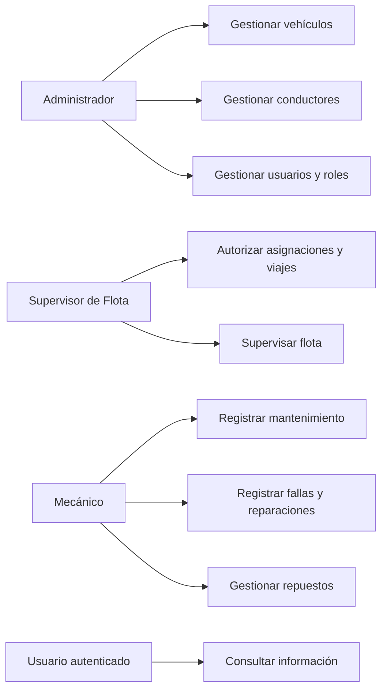

```mermaid
flowchart LR
A[Administrador] --> B[Gestionar vehículos]
A --> C[Gestionar conductores]
A --> D[Gestionar usuarios y roles]
S[Supervisor de Flota] --> E[Autorizar asignaciones y viajes]
S --> F[Supervisar flota]
M[Mecánico] --> G[Registrar mantenimiento]
M --> H[Registrar fallas y reparaciones]
M --> I[Gestionar repuestos]
U[Usuario autenticado] --> J[Consultar información]
```
