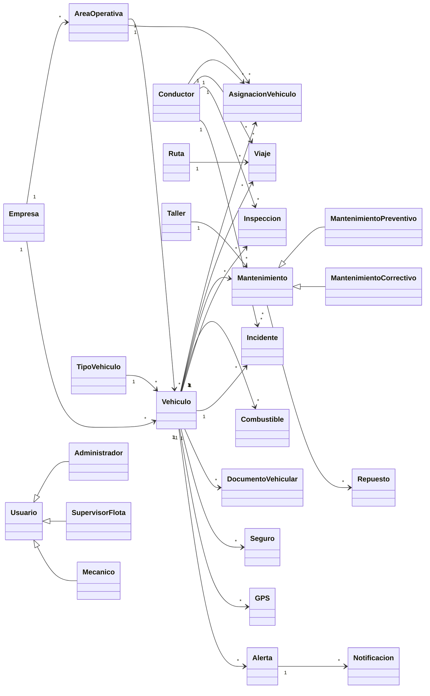

```mermaid
classDiagram
direction LR

class Empresa
class AreaOperativa
class TipoVehiculo
class Vehiculo
class Conductor
class AsignacionVehiculo
class Viaje
class Ruta
class Mantenimiento
class MantenimientoPreventivo
class MantenimientoCorrectivo
class Repuesto
class Taller
class Combustible
class Inspeccion
class Incidente
class DocumentoVehicular
class Seguro
class GPS
class Alerta
class Notificacion
class Usuario
class Administrador
class SupervisorFlota
class Mecanico

Empresa "1" --> "*" AreaOperativa
Empresa "1" --> "*" Vehiculo
AreaOperativa "1" --> "*" Vehiculo
TipoVehiculo "1" --> "*" Vehiculo
Vehiculo "1" --> "*" AsignacionVehiculo
Conductor "1" --> "*" AsignacionVehiculo
AreaOperativa "1" --> "*" AsignacionVehiculo
Vehiculo "1" --> "*" Viaje
Conductor "1" --> "*" Viaje
Ruta "1" --> "*" Viaje
Vehiculo "1" --> "*" Mantenimiento
Mantenimiento <|-- MantenimientoPreventivo
Mantenimiento <|-- MantenimientoCorrectivo
Mantenimiento "*" --> "*" Repuesto
Taller "1" --> "*" Mantenimiento
Vehiculo "1" --> "*" Combustible
Vehiculo "1" --> "*" Inspeccion
Conductor "1" --> "*" Inspeccion
Vehiculo "1" --> "*" Incidente
Conductor "1" --> "*" Incidente
Vehiculo "1" --> "*" DocumentoVehicular
Vehiculo "1" --> "*" Seguro
Vehiculo "1" --> "*" GPS
Vehiculo "1" --> "*" Alerta
Alerta "1" --> "*" Notificacion
Usuario <|-- Administrador
Usuario <|-- SupervisorFlota
Usuario <|-- Mecanico
```
